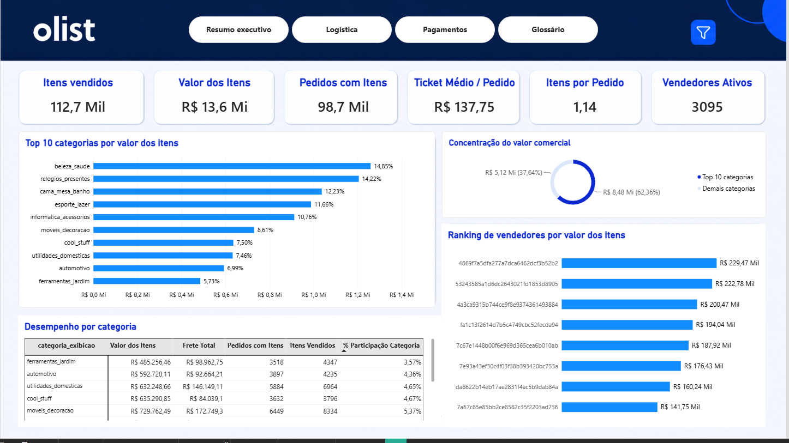
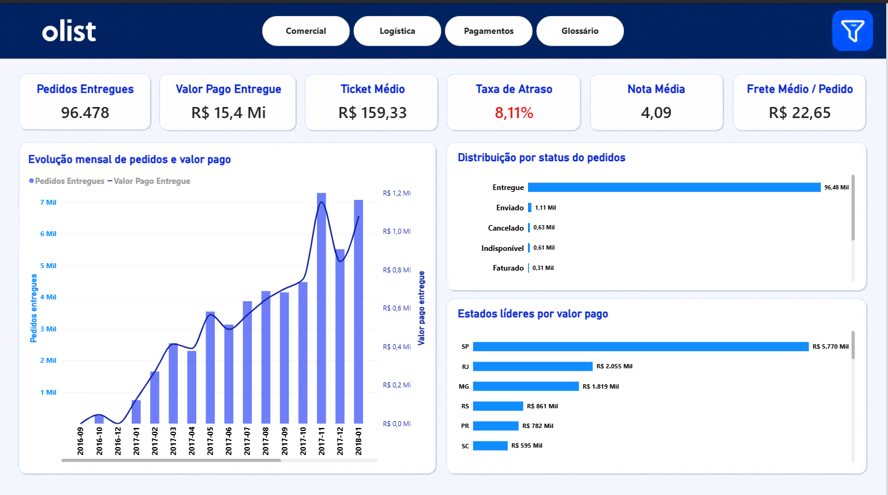

# 🛒 Brazilian E-Commerce — Olist

Projeto de análise de dados desenvolvido como entrega do Tech Challenge da FIAP, utilizando o dataset público de E-Commerce brasileiro da Olist.

O projeto contempla o processo completo de download, organização, carga e análise dos dados, utilizando Python, SQL Server e Power BI.

## 📌 Sobre o projeto

O objetivo deste projeto é trabalhar com um conjunto de dados real de vendas de e-commerce, realizando desde o download e organização dos arquivos, passando pela carga das informações em um banco de dados SQL Server, até a análise e visualização dos dados por meio de um relatório desenvolvido no Power BI.

O projeto busca aplicar, na prática, conceitos relacionados a:

- Python
- ETL
- SQL Server
- T-SQL
- Stored Procedures
- BULK INSERT
- Modelagem e organização de dados
- Análise de dados
- Power BI
- Construção de indicadores e visualizações

## 🎓 Tech Challenge — FIAP

Este projeto foi desenvolvido como parte da entrega do Tech Challenge da FIAP, tendo como objetivo aplicar os conhecimentos adquiridos durante a formação em um cenário prático de análise de dados.

A solução foi estruturada considerando um fluxo de dados desde a obtenção do dataset até sua disponibilização para análise no Power BI.

## 🔄 Fluxo do projeto

```
DATASET OLIST
    |
    v
PYTHON (download dos dados)
    |
    v
ARQUIVOS CSV
    |
    v
SQL SERVER
    |
    v
STORED PROCEDURE
    |
    v
TABELAS TC1
    |
    v
POWER BI (relatório / análises)
```

## 📊 Resultado — Power BI

Prints do relatório final, conectado às tabelas do schema `TC1` no SQL Server:

**Capa**


**Resumo comercial**


**Logística e pagamentos**


## 🛠️ Tecnologias utilizadas

- Python
- SQL Server
- T-SQL
- Power BI
- Pandas
- Kaggle
- VS Code
- Git / GitHub

## 🗂️ Dataset

O projeto utiliza o Brazilian E-Commerce Public Dataset by Olist, disponibilizado publicamente através do Kaggle.

O dataset contém informações relacionadas a:

- Clientes
- Pedidos
- Produtos
- Vendedores
- Itens dos pedidos
- Pagamentos
- Avaliações
- Localização
- Categorias de produtos

### Principais arquivos

| Arquivo | Descrição |
|---|---|
| olist_customers_dataset.csv | Dados dos clientes |
| olist_geolocation_dataset.csv | Dados de localização |
| olist_order_items_dataset.csv | Itens dos pedidos |
| olist_order_payments_dataset.csv | Informações de pagamentos |
| olist_order_reviews_dataset.csv | Avaliações dos pedidos |
| olist_orders_dataset.csv | Informações dos pedidos |
| olist_products_dataset.csv | Dados dos produtos |
| olist_sellers_dataset.csv | Dados dos vendedores |
| product_category_name_translation.csv | Tradução das categorias |

## 🐍 Python

O Python é responsável pelo download do dataset e pela disponibilização dos arquivos CSV na pasta utilizada pelo processo de carga do SQL Server.

O script realiza o download dos arquivos e os direciona para uma pasta local.

### 📂 Caminho dos arquivos

Por padrão, o projeto utiliza:

```
C:\Users\felip\Downloads\archive
```

Caso seja necessário utilizar outro diretório, o caminho de destino deve ser alterado no script Python.

Exemplo:

```python
PASTA_DESTINO = r"C:\Users\felip\Downloads\archive"
```

Altere o valor de `PASTA_DESTINO` para o diretório desejado.

## 🗄️ SQL Server

Após o download dos arquivos, os dados são carregados no banco de dados:

```
DB_CHALLENGER
```

As tabelas utilizadas no projeto estão organizadas no schema:

```
TC1
```

### Tabelas

- TC1.customers_dataset
- TC1.geolocation
- TC1.order_items
- TC1.order_payments
- TC1.order_reviews
- TC1.orders
- TC1.products
- TC1.sellers
- TC1.product_category

## ⚙️ Stored Procedure

O processo de carga dos arquivos CSV é centralizado através da Stored Procedure:

```
TC1.sp_carga_olist
```

A procedure utiliza BULK INSERT para importar os arquivos CSV para as respectivas tabelas do SQL Server.

Exemplo:

```sql
USE DB_CHALLENGER;
GO

EXEC TC1.sp_carga_olist;
```

### 📂 Configuração do caminho no SQL Server

A Stored Procedure também possui o caminho dos arquivos CSV utilizado pelo BULK INSERT.

Por padrão:

```
C:\Users\felip\Downloads\archive
```

Exemplo:

```sql
BULK INSERT TC1.customers_dataset
FROM 'C:\Users\felip\Downloads\archive\olist_customers_dataset.csv'
WITH (
    FORMAT = 'CSV',
    FIRSTROW = 2,
    FIELDQUOTE = '"',
    FIELDTERMINATOR = ',',
    ROWTERMINATOR = '0x0a',
    TABLOCK
);
```

### ⚠️ Importante

Caso o diretório dos arquivos seja alterado, é necessário alterar o caminho tanto no Python quanto na Stored Procedure do SQL Server.

Por exemplo, se os arquivos forem armazenados em:

```
D:\Projetos\Olist\archive
```

o caminho deverá ser atualizado nos dois pontos:

Python:

```python
PASTA_DESTINO = r"D:\Projetos\Olist\archive"
```

SQL Server:

```sql
FROM 'D:\Projetos\Olist\archive\olist_customers_dataset.csv'
```

Essa alteração deve ser realizada para os demais arquivos utilizados pela procedure.

Observação: o caminho informado no BULK INSERT precisa ser acessível pelo servidor/instância do SQL Server que estiver executando a carga.

## 📊 Power BI

Após a carga e organização dos dados no SQL Server, as informações são utilizadas como fonte para o desenvolvimento do relatório no Power BI (prints na seção Resultado, acima).

O objetivo dessa etapa é transformar os dados armazenados no banco em informações relevantes para análise, através de:

- Indicadores de desempenho
- Análise de vendas
- Análise de faturamento
- Análise de pedidos
- Análise de produtos
- Análise de categorias
- Análise de vendedores
- Análise de pagamentos
- Análise de avaliações
- Indicadores de negócio
- Visualizações interativas

O Power BI é utilizado como camada de Business Intelligence, permitindo a exploração dos dados e a apresentação dos principais insights obtidos a partir do dataset.

## 📁 Estrutura do projeto

```
├── Python/
│   └── download_dataset.py
│
├── SQL/
│   └── sp_carga_olist.sql
│
├── screenshots/
│   ├── capa/
│   ├── comercial/
│   └── logistica/
│
└── README.md
```

O arquivo `.pbix` do relatório não está versionado no repositório (arquivo binário grande); os prints acima mostram o resultado final.

## 🚀 Como executar o projeto

1. **Clonar o repositório**

```
git clone URL_DO_REPOSITORIO
```

2. **Configurar o Python**

Abra o arquivo `python/download_dataset.py` e verifique o caminho:

```python
PASTA_DESTINO = r"C:\Users\felip\Downloads\archive"
```

Caso necessário, altere para o diretório desejado.

3. **Executar o Python**

Execute o script para realizar o download do dataset. Os arquivos CSV serão armazenados na pasta configurada.

4. **Configurar o SQL Server**

Execute o script de criação das tabelas no banco `DB_CHALLENGER`.

5. **Configurar a Stored Procedure**

Execute `sql/sp_carga_olist.sql` no SQL Server. Verifique se os caminhos dos arquivos na procedure correspondem ao diretório configurado no Python.

6. **Executar a carga**

```sql
USE DB_CHALLENGER;
GO

EXEC TC1.sp_carga_olist;
```

7. **Conectar o Power BI**

Após a carga dos dados, conecte o Power BI ao banco `DB_CHALLENGER` e utilize as tabelas do schema `TC1` como fonte para construção do relatório.

## 🎯 Objetivo final

O projeto tem como objetivo demonstrar um fluxo completo de dados:

Download → ETL → SQL Server → Carga → Modelagem → Power BI → Análise

Dessa forma, a solução integra Python, banco de dados e Business Intelligence, transformando dados brutos de e-commerce em informações que podem ser utilizadas para análise e tomada de decisão.

## 👨‍💻 Autores

Felipe Miranda, Thamyres Schroeder e Guilherme Tavares Azevedo

Projeto desenvolvido como entrega do Tech Challenge — FIAP, com foco em Dados, SQL, Python e Business Intelligence.
